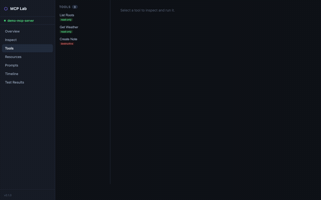

# MCP Workbench

**A quality platform for MCP server developers.**

Test, inspect, and validate [Model Context Protocol](https://modelcontextprotocol.io) servers — from the command line or in CI.

[](https://github.com/raeseoklee/mcp-workbench/actions/workflows/ci.yml)
[](LICENSE)

```
MCP Workbench = Inspector + Contract Test + Regression Diff + CI Runner
```


---

## Why MCP Workbench?

The MCP ecosystem has debugging tools (Inspector) and SDKs, but no dedicated quality validation platform.
MCP Workbench fills that gap: **saved tests, regression diffs, and CI-ready assertion runs**.

| Tool | Interactive Debug | Saved Tests | Regression Diff | CI Runner |
|------|:-----------------:|:-----------:|:---------------:|:---------:|
| MCP Inspector | ✓ | — | — | — |
| **MCP Workbench** | ✓ | **✓** | **✓** | **✓** |

---

## Features

- **`mcp-workbench inspect`** — connect to any MCP server and explore its capabilities, tools, resources, and prompts
- **`mcp-workbench run`** — execute YAML-defined test suites with rich assertions
- **Assertion engine** — `status`, `jsonpath`, `executionError`, `protocolError`, `contentType`, `count`, `notEmpty`, `equals`, `schema`, and more
- **Transport support** — `stdio` (local servers), `streamable-http` (remote servers), legacy SSE
- **Client simulator** — inject roots, sampling presets, and elicitation handlers so you can test server→client capability flows
- **CI-friendly** — `--json` output, non-zero exit on failure, `--bail` flag
- **Protocol-accurate** — implements MCP spec `2025-11-25` including capability negotiation, session lifecycle, and notification handling
- **Browser UI** — full-featured web inspector with Protocol tab (DevTools-style request/response log), dark/light mode, and live test runner
- **Plugin system** — extend with reporters (`html`, `junit`) and custom commands via `--plugin` or `workbench.config.yaml`

---

## Installation

```bash
npm install -g mcp-workbench
# or
pnpm add -g mcp-workbench
```

---

## Quick Start

### Try it now (zero setup)

Install the CLI and the bundled demo server, then inspect it:

```bash
npm install -g mcp-workbench @mcp-workbench/demo-server

mcp-workbench inspect --command mcp-workbench-demo
```

The demo server exposes a weather tool, note resources, and a greeting prompt — everything you need to explore all of MCP Workbench's features without writing a single line of server code.

### Inspect a server

```bash
# stdio (local server)
mcp-workbench inspect --command node --args "path/to/server.js"

# HTTP (remote server)
mcp-workbench inspect --transport streamable-http --url https://your-server.com/mcp
```

Example output:

```
  Server Info

  Name:     my-mcp-server
  Version:  1.0.0
  Protocol: 2025-11-25

  Capabilities

  ✓ tools (listChanged)
  ✓ resources (subscribe)
  ✓ prompts
  ○ completions
  ○ logging

  Tools (3)

  get_weather [read-only]
    Get current weather for a city
  create_file [destructive]
    Create or overwrite a file
```

### Run a test suite

```bash
mcp-workbench run tests.yaml
mcp-workbench run tests.yaml --verbose
mcp-workbench run tests.yaml --json > results.json
mcp-workbench run tests.yaml --bail --timeout 5000
```

Try the included fixture against the demo server:

```bash
mcp-workbench run examples/fixtures/demo-server.yaml --verbose
```

---

## Test Specification Format

Test suites are YAML files with the `mcp-workbench.dev/v0alpha1` schema.

```yaml
apiVersion: mcp-workbench.dev/v0alpha1

server:
  transport: stdio
  command: node
  args:
    - dist/server.js

# or for remote:
# server:
#   transport: streamable-http
#   url: https://your-server.com/mcp
#   headersFromEnv:
#     Authorization: MCP_API_TOKEN

client:
  protocolVersion: "2025-11-25"

tests:
  - id: tools-list
    description: Server exposes at least one tool
    act:
      method: tools/list
    assert:
      - kind: status
        equals: success
      - kind: notEmpty
        path: $.tools

  - id: get-weather
    description: Weather tool returns text for a valid city
    act:
      method: tools/call
      tool: get_weather
      args:
        city: Seoul
    assert:
      - kind: executionError
        equals: false
      - kind: contentType
        contains: text
      - kind: jsonpath
        path: $.content[0].text
        matches: "Seoul"

  - id: invalid-input
    description: Tool returns execution error (not protocol error) for bad input
    act:
      method: tools/call
      tool: get_weather
      args:
        city: 12345
    assert:
      - kind: executionError
        equals: true
      - kind: protocolError
        equals: false
```

### Assertion Reference

| Kind | Description |
|------|-------------|
| `status` | `equals: success \| error` — overall call status |
| `executionError` | `equals: true \| false` — tool `isError` flag |
| `protocolError` | `equals: true \| false` — JSON-RPC error response |
| `jsonpath` | JSONPath query with `equals`, `contains`, `matches`, or `notEmpty` |
| `notEmpty` | target is non-empty string / array / object |
| `contentType` | checks `content[*].type` — `equals` or `contains` |
| `count` | array length — `equals`, `min`, `max` |
| `equals` | deep equality at optional `path` |
| `schema` | JSON Schema validation at optional `path` |
| `outputSchemaValid` | validates tool `structuredContent` against `outputSchema` |

---

## CLI Reference

### `mcp-workbench inspect`

```
mcp-workbench inspect [options]

Options:
  --transport <kind>   stdio | streamable-http | sse  (default: stdio)
  --command <cmd>      Command to run (stdio)
  --args <args>        Space-separated arguments (stdio)
  --url <url>          Server URL (HTTP)
  --timeout <ms>       Request timeout
  --json               JSON output
  --lang <locale>      Output language: en | ko  (env: MCP_WORKBENCH_LANG)
```

### `mcp-workbench run`

```
mcp-workbench run <spec-file> [options]

Options:
  --tags <tags>        Run only tests matching these comma-separated tags
  --ids <ids>          Run only tests with these comma-separated IDs
  --bail               Stop after first failure
  --timeout <ms>       Per-request timeout
  --json               JSON output (CI-friendly)
  -v, --verbose        Show all assertion details
  --lang <locale>      Output language: en | ko  (env: MCP_WORKBENCH_LANG)
```

---

## Internationalization

CLI output is available in multiple languages.

```bash
# Korean output via flag
mcp-workbench run tests.yaml --lang ko

# Korean output via environment variable
MCP_WORKBENCH_LANG=ko mcp-workbench inspect --command mcp-workbench-demo
```

| Locale | Language |
|--------|----------|
| `en`   | English (default) |
| `ko`   | Korean |

Only user-facing CLI messages are translated. JSON output (`--json`), protocol payloads, and assertion keys are always in English.

To add a new locale, see [docs/i18n.md](docs/i18n.md).

---

## Architecture

MCP Workbench is a pnpm monorepo. The public package is `mcp-workbench`. Internal libraries are published under `@mcp-workbench/*`.

```
apps/
  cli                  — CLI entry point (mcp-workbench command)
  web                  — Browser UI (Vite + React)
  api                  — API server bridging the UI to MCP packages

packages/
  protocol-kernel      — JSON-RPC 2.0 + MCP types, ProtocolKernel class
  session-engine       — Session lifecycle, Timeline recording
  transport-stdio      — stdio child-process transport
  transport-http       — Streamable HTTP + SSE transport
  assertions           — Assertion engine
  test-spec            — YAML spec types and parser
  client-simulator     — Roots / sampling / elicitation capability simulator

examples/
  demo-server          — Demo MCP server (tools, resources, prompts)
  fixtures/            — Example test specs
```

---

## Web UI

MCP Workbench includes a browser-based inspector. Start the API server and the Vite dev server:

```bash
# Terminal 1 — API server
node apps/api/dist/index.js

# Terminal 2 — Web UI (http://localhost:5173)
pnpm --filter @mcp-workbench/web dev
```

Connect to any MCP server from the Inspect page, then browse Tools, Resources, Prompts, and watch the live Protocol log.

To try it with the demo server, enter these values on the Inspect page:

| Field | Value |
|-------|-------|
| Transport | stdio |
| Command | `mcp-workbench-demo` |
| Args | *(leave empty)* |

**Protocol Inspector** — the Protocol tab shows every MCP message (initialize, tools/call, resources/read, etc.) as a DevTools-style request/response log with syntax-highlighted JSON payloads, status indicators, and duration timings.

The UI supports dark and light mode — toggle with the `☀`/`☾` button in the sidebar.



---

## Plugins

MCP Workbench has an extensible plugin system for reporters and custom commands.

```bash
# Generate an HTML report after running tests
mcp-workbench run tests.yaml \
  --plugin @mcp-workbench/plugin-html-report \
  --reporter html

# Generate JUnit XML for CI (GitHub Actions, Jenkins, etc.)
mcp-workbench run tests.yaml \
  --plugin @mcp-workbench/plugin-junit \
  --reporter junit \
  --reporter-output test-results.xml
```

Or configure plugins permanently in `workbench.config.yaml`:

```yaml
plugins:
  - "@mcp-workbench/plugin-html-report"
  - "@mcp-workbench/plugin-junit"
```

See [docs/plugins.md](docs/plugins.md) for the full plugin guide including how to build your own.

---

## Contributing

See [CONTRIBUTING.md](CONTRIBUTING.md).

---

## License

[Apache-2.0](LICENSE)
